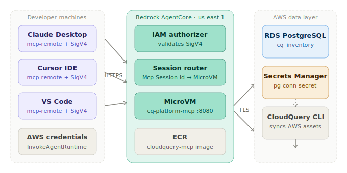
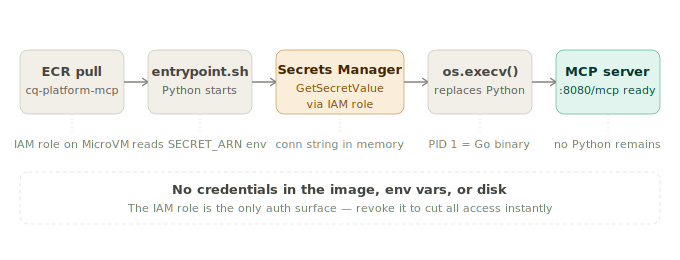
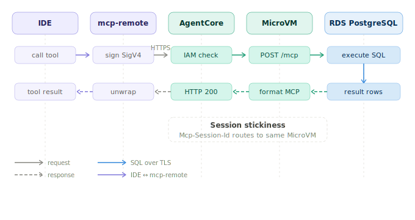
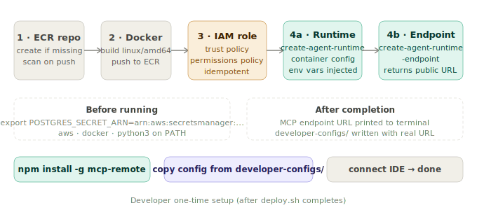

# cloudquery-mcp-agentcore

Deploy the official [CloudQuery MCP Server](https://www.cloudquery.io/docs/platform/features/mcp-server)
(PostgreSQL mode) onto **Amazon Bedrock AgentCore Runtime** and expose it to
your developers via Claude Desktop, Cursor, and VS Code.

## Architecture

```
Developer IDEs (Claude Desktop / Cursor / VS Code)
        │  mcp-remote (npm) — MCP over Streamable HTTP + AWS SigV4
        ▼
Amazon Bedrock AgentCore Runtime (us-east-1, port 8080, path /mcp)
  └── cq-platform-mcp v1.8.1 (official CloudQuery binary)
        │  entrypoint.sh fetches POSTGRES_CONNECTION_STRING
        │  from AWS Secrets Manager via IAM role at startup
        ▼
RDS / Aurora PostgreSQL (synced by CloudQuery CLI)
```

## Quick Start

```bash
# 1. Create the Secrets Manager secret with your RDS credentials
aws secretsmanager create-secret \
  --name cloudquery/pg-conn \
  --secret-string '{"username":"cloudquery","password":"...","host":"...","port":5432,"dbname":"cq_inventory"}' \
  --region us-east-1

# 2. Export the secret ARN
export POSTGRES_SECRET_ARN=arn:aws:secretsmanager:us-east-1:ACCOUNT:secret:cloudquery/pg-conn-XxXxXx

# 3. Deploy
chmod +x deploy.sh && ./deploy.sh
```

## Developer Setup

1. `npm install -g mcp-remote`
2. After running `deploy.sh`, copy your config from `developer-configs/`:
   - **Claude Desktop** → `~/Library/Application Support/Claude/claude_desktop_config.json`
   - **Cursor** → Settings → Tools and Integrations → Add MCP Server
   - **VS Code** → `Cmd+Shift+P` → MCP: Open User Configuration

## Available MCP Tools (PostgreSQL Mode)

| Tool | Description |
|---|---|
| `postgres-list-plugins` | List CloudQuery integrations in the DB |
| `postgres-table-search-regex` | Search tables by regex (e.g. `aws_ec2.*`) |
| `postgres-table-schemas` | Get column definitions for tables |
| `postgres-column-search` | Search columns by regex across all tables |
| `execute-postgres-query` | Run SQL against the CloudQuery inventory DB |

## Files

| File | Purpose |
|---|---|
| `Dockerfile` | Wraps official `cq-platform-mcp` binary, non-root, hardened |
| `entrypoint.sh` | Fetches DB credentials from Secrets Manager at startup |
| `.bedrock_agentcore.yaml` | AgentCore runtime config (MCP protocol, port 8080) |
| `deploy.sh` | One-command ECR + IAM + AgentCore deployment |
| `iam/execution-role.json` | Least-privilege IAM trust + permissions policy |
| `developer-configs/` | IDE configs for Claude Desktop, Cursor, VS Code |


## Diagrams

### System overview


### Container startup


### Request lifecycle


### Deployment steps
